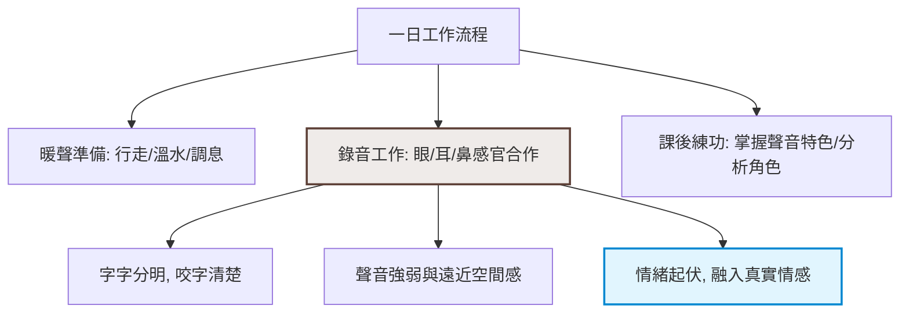
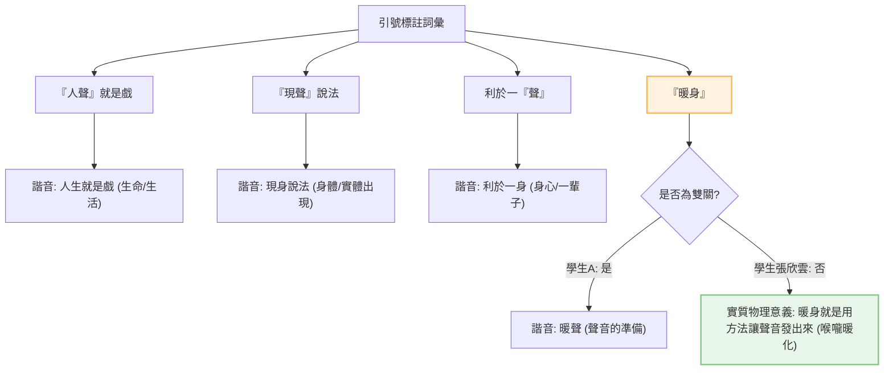

# 國語公開課：學習共同體課堂教學分析報告 (深度重構版)

本報告針對新北市光復國小五年級 506 班執教的國語公開課「人『聲』就是戲」進行全面性的微觀對話分析與哲學文獻對照。本報告基於影片 `T6-Cvf05lFU` 的完整語音轉譯逐字稿進行重構，並深度結合您雲端硬碟中 [學共論文參考文獻/閱讀筆記](file:///g:/我的雲端硬碟/學共論文參考文獻/閱讀筆記) 的學術文獻（維高斯基 Vygotsky、杜威 Dewey、考登 Cazden、巴恩斯坦 Bernstein 與佐藤學的理論）。

---

## 📢 影片來源與連結核對聲明

本堂課的實況紀錄對應以下影片與逐字稿：
*   **影片**：五年級國語課 506 班 (ID: `T6-Cvf05lFU`)，對應 [逐字稿 transcript_T6-Cvf05lFU.txt](file:///g:/我的雲端硬碟/antigravity2/學習共同體課堂影片分析/transcript_T6-Cvf05lFU.txt) 及 [JSON 檔 transcript_T6-Cvf05lFU_zh-TW.json](file:///g:/我的雲端硬碟/antigravity2/學習共同體課堂影片分析/transcript_T6-Cvf05lFU_zh-TW.json)。
*   **教學文本**：康軒版國小國語五年級下學期第六課《人「聲」就是戲》（說明文），其引導與理解參考 [國小國語5下閱讀理解_text.txt](file:///g:/我的雲端硬碟/antigravity2/學習共同體課堂影片分析/國小國語5下閱讀理解_text.txt#L79-L90)。
*   **教學進程**：引導學生默讀與標註「好的配音員條件」（定位段落、不照抄課文），小組內輪流分享與傾聽同儕觀點，全班討論凝聚配音員條件，隨後深入探究文本中的「諧音雙關」修辭（包含「人聲/人生」、「現聲/現身」、「一身/一聲」、「暖身/暖聲」的後設辯析）。

---

## 一、 國語任務與文本結構分析

### 1. 說明文文本結構重構
本課是一篇介紹「配音員」職業的一日工作流說明文。課堂中學生必須從文本提取並詮釋配音員在各個階段所需具備的專業特質：
*   **工作前（暖聲階段）**：行走、運動、喝溫水、調整呼吸、放聲呼喊。
*   **工作時（錄音階段）**：字字分明、聲音強弱與遠近變化、轉換心情融入真實情感。聲音導演提示之「眼盯螢幕嘴形」、「耳聽外語配音」、「鼻提氣調息」。
*   **工作後（進修階段）**：分析人物、欣賞作品、開發獨特嗓音、掌握自身聲音特色、學習多元語言。

### 2. 配音員一日工作與修辭判定流向（Mermaid 流程圖）

在 506 班的課堂討論中，學生思維的流向呈現「工作特質提取」與「雙關修辭分析」雙軌並進的結構：

#### 配音員條件與日常工作流

#### 課堂雙關修辭 (諧音雙關) 判定邏輯

---

## 二、 學習共同體哲學文獻的深度對照與解析

對照您硬碟中的文獻筆記，本堂國語課展現了以下教育哲學的核心實踐：

### 1. 社會建構主義與「傾聽他者」的 ZPD 建構 (Vygotsky 與佐藤學)
在小組討論結束後的發表階段，教師的提問並非「你找到了什麼？」而是「秀芷琳，你的同學和品靚同學，他們找到的好的配音條件有什麼？」（[19:54]）。
*   **文獻哲學解讀**：
    維高斯基的社會建構主義強調，學習不是個體孤立的認知獲取，而是在**社會性交往**中，透過語言工具在「近側發展區（Zone of Proximal Development, ZPD）」內實現的。
    佐藤學亦指出，學習共同體的建立始於「傾聽的關係」。教師不讓學生發表「自己的成就」，而是要求學生「說出同儕的發現」。這強迫學生在小組討論中必須專注「傾聽他人」，將他人的語言內化為自己的心理學工具，建立了「協同學習（Collaborative Learning）」的民主關係。

### 2. 從「引號識別」到「脈絡辨析」的符碼轉換 (Bernstein 與 Cazden)
在雙關修辭討論中，學生一開始僅依賴課文中的「雙引號」作為標記來尋找雙關詞彙。教師進一步引導學生探究其雙關背後的實質語意（[27:08] - [38:38]）。
*   **文獻哲學解讀**：
    巴恩斯坦（Bernstein）將語言分為**「限制型符碼」**（依賴情境與表層特徵，如僅憑引號斷定雙關）與**「精緻型符碼」**（需脫離具體符號，從複雜語境與意圖中進行意義重建）。
    當學生指出「現聲說法」時，教師追問「為什麼他要寫聲音的聲？他應該替換掉哪個字？」。學生必須從限制型符碼（引號字）轉譯為精緻型符碼（配音員只出其聲、不出其人，故將「現身」諧音為「現聲」的物理情境）。這展現了考登（Cazden）《教室言談》中，言談作為思維鷹架、促進概念命名的認知飛躍。

### 3. 反省性思維與後設認知辯析 (Dewey 與 Schön)
在探究「暖身」一詞是否構成雙關時，杜成陽同學提出其為雙關，而張欣雲同學則提出質疑，認為「暖身」只是用方法讓聲音發出來，實質上指喉嚨物理準備，並非諧音雙關（[37:27] - [38:38]）。
*   **文獻哲學解讀**：
    杜威（Dewey）將「反省性思維（Reflective Thinking）」定義為對任何信念或知識形式進行積極、持續且謹慎的考量。
    在傳統灌輸式課堂中，教師往往扮演標準答案的給予者。但在本對話中，教師實踐了肖恩（Schön）的**「行動中反思（Reflection-in-action）」**，引導張欣雲說明其論據，讓學生的後設認知在課堂中碰撞。教師與學生共同探究早上起床喉嚨乾涸、需喝溫水活動的生理現象，證實了「暖身/暖聲」在該文本脈絡下是具備實質物理意義的喉嚨暖化，而非純粹修辭遊戲。

---

## 三、 課堂進程與微觀對話解析

### 階段 1：自主閱讀與定位（[00:00] - [03:58]）
在教學初始，教師為學生的直覺按下煞車，要求學生以「莫讀」方式理清文本關係，並拒絕照抄：
*   **微觀對話**（[03:56]）：
    > *   **教師**：那些是你認為好的配音員要有條件。那我請你不要抄課文，不要抄課文。你簡單寫下，他是在第幾頁、第幾段、第幾句……哪個關鍵的語詞或是行為，你覺得是一個好的配音員應該要有的，簡單寫一下。
*   **認知分析**：
    教師要求學生「不抄課文」，迫使學生放棄機械式的複製（低階認知），轉而進行「概念提取」與「段落定位」（高階整合）。這是一種去技能化的教學設計，旨在促成學生與文本的深層對話。

### 階段 2：個人探究與書寫（[03:58] - [13:51]）
此階段學生安靜書寫個人筆記，教室時間呈現「去產業化」的緩慢節奏。學生在空白處書寫條件與定位，為後續的對話累積「心理學工具」。

### 階段 3：小組分享與傾聽（[13:51] - [19:44]）
教師引導小組內的傾聽，並為後續的全班分享埋下伏筆：
*   **微觀對話**（[14:06]）：
    > *   **教師**：把你找到的跟你的組員做一個討論跟分享，但不是叫你把你跟同學的全部抄上去喔。等一下同學輪流分享，請仔細聽，同學找到的是在第幾段第幾句，那為什麼同學會認為他找到的答案叫做好的配音員條件。
*   **哲學解讀**：
    佐藤學認為，小組討論不是為了「統一答案」，而是為了「分享多樣性」。教師要求學生記錄同儕的理由，這為教室建立了「公共傾聽」的互惠機制。

### 階段 4：全班分享與雙關辨析（[19:44] - [39:03]）
課堂高潮在於「雙關修辭」的微觀論證，學生展開了精彩的後設辨析：
*   **微觀對話**（[37:27]）：
    > *   **教師**：杜成陽又找到在第二段的地方……配音員會運用自己喜好的方法來做暖聲，他說「暖身」，欸，你覺得他有雙關嗎？……張欣雲，你為什麼認為他沒有？
    > *   **學生 (張欣雲)**：因為這個暖身的聲（身），他就是用方法讓自己的聲音可以發出來的意思，所以他實際上，你覺得他是沒有雙關的。
    > *   **教師**：很好啊，對啊。因為像我們早上起床，一般人不會發出聲音，沒辦法，因為你喉嚨經過一整個晚上休息，水分沒有流到喉嚨，是乾的。所以他在進行配音之前，要讓自己的聲音可以適應，所以暖身確實就是喉嚨的準備。
*   **認知分析**：
    這是一段極具反思特質的對話。張欣雲突破了「引號即雙關」的直覺壁壘，回歸到文字的物理指涉。教師沒有扮演權威評判者，而是藉由生活經驗（晨起喉嚨乾涸）來共鳴並強化學生的認知結構，實現了杜威所稱的「經驗的重組與改造」。

---

## 四、 教學啟示與建議

1.  **「被動教態」與傾聽的實踐**：
    本堂課教師成功展現了「被動的教態」。當學生回答錯誤或卡關時，教師不急於糾正，而是通過「有沒有不一樣的想法嗎？」或「誰可以幫忙解釋？」將話語權還給學生。這種「等待與傾聽」是協同學習的核心。
2.  **設計更具挑戰性的語文「跳躍任務 (Jump)」**：
    本課學生在提取配音員條件與雙關判定上已展現高度熟練度。為促進學生的「伸展跳躍」，建議在課堂後半段設計一個「聲音導演實作任務」：
    *   *任務設計*：給予小組一段無聲的卡通片段（如 20 秒），要求學生在黑板上標記出角色的動作、嘴形，並以「強弱、遠近、情緒轉換」為該片段設計配音稿並現場配音。這能將說明的「條件語句」轉化為實際的「語文實踐」，達成深度的探究學習。
