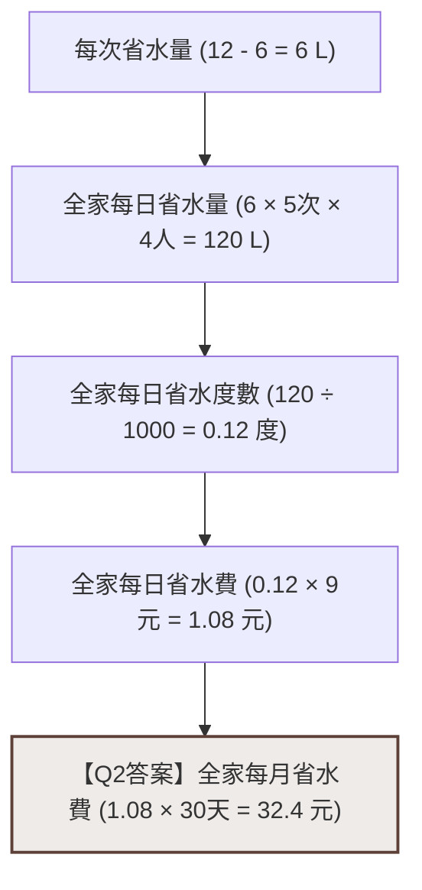
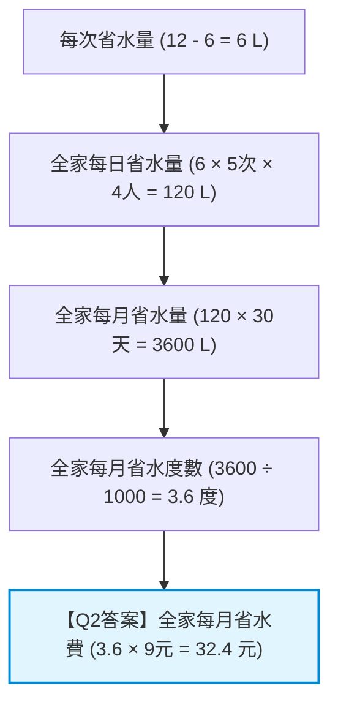

# 數學公開課：學習共同體課堂教學分析報告 (深度重構版)

本報告針對新北市光復國小校長於五年級 503 班執教的數學公開課「容積與容量應用問題」進行全面性的微觀對話分析與哲學文獻對照。本報告基於以下三段完整影片的逐字稿進行重構，並深度結合您雲端硬碟中 [學共論文參考文獻/閱讀筆記](file:///g:/我的雲端硬碟/學共論文參考文獻/閱讀筆記) 的學術文獻（維高斯基 Vygotsky、杜威 Dewey、考登 Cazden 與佐藤學的理論）。

---

## 📢 影片來源與連結核對聲明

本堂課的實況紀錄由以下三段影片組成，各階段教學進程如下：
1.  **影片 1 (全景1)**：[20260507503數學容積(全景1)](file:///g:/我的雲端硬碟/antigravity2/學習共同體課堂影片分析/transcript_2qaBMMWbYDk.txt) (ID: `2qaBMMWbYDk`)
    *   **教學進程**：引導學生閱讀文本，劃記「條件語句」與「核心問句」，完成學習單前半部，小組展開輕聲討論。
2.  **影片 2 (全班2)**：[20260507503數學容積全班影片2](file:///g:/我的雲端硬碟/antigravity2/學習共同體課堂影片分析/transcript_qaTGAnbhpX4.txt) (ID: `qaTGAnbhpX4`)
    *   **教學進程**：全班核對「核心問句」與「條件語句」，要求學生不要使用算式，改用「中文口語」表述解題邏輯，隨後小組開始計算。
3.  **影片 3 (全班3)**：[20260507503數學容積全班影片3](file:///g:/我的雲端硬碟/antigravity2/學習共同體課堂影片分析/transcript_SCW-T9SxsrM.txt) (ID: `SCW-T9SxsrM`)
    *   **教學進程**：學生代表於黑板列式。校長帶領全班進行「算法對比」，引導學生辨析「先算日水費（芷妃法）」與「先算月水量（季顯法）」的邏輯與認知效率差異，最後進行反思結課。

---

## 一、 數學任務與解題邏輯的雙重路徑

### 1. 數學任務情境重構
*   **情境**：某家庭一家四口，每人每天平均沖馬桶 5 次。若將傳統馬桶（每次沖水 12 公升或 12.6 公升）改為省水馬桶（每次沖水 6 公升）。水費每度 9 元（1 度 = 1000 公升）。
*   **任務目標**：
    1.  每天約可省下多少水量（公升）？
    2.  每個月（以 30 天計）約可省下多少水費（元）？

### 2. 學生多元解法之邏輯流向（Mermaid 流程圖）

在影片 3 中，黑板上呈現了兩種本質不同、但結果一致的運算邏輯，這反映了學生不同的空間與時間換算尺度：

#### 算法 A：芷妃的「日水費先算法」
芷妃的思維是「以日為基礎」計算水費，最後再放大至月：

#### 算法 B：季顯的「月水量先算法」
季顯的思維是「先將水量在時間上放大」，最後再進行度數與水費換算：

---

## 二、 學習共同體哲學文獻的深度對照與解析

對照您硬碟中的文獻筆記，本堂課在不同發展階段展現了深厚的哲學基礎：

### 1. 語言作為「心理學工具」的認知轉換 (Vygotsky 與 Dewey)
在影片 2 中，校長要求學生不使用數字與算式，改用中文表述步驟（「全體中文」）。
*   **文獻哲學解讀**：
    維高斯基將語言定義為決定性的**「心理學工具」**（杜威稱為「工具的工具」）。文獻載明：*「學習的對象是學習者借助語言給予命名才建構意義的」*。算式（如 $(12-6) \times 5 \times 4$）是高度抽象的預設外部符號，學生若直接套用，容易陷入「被動的、機械的習得」，流於純粹的操作技術。
    校長要求學生用文字描述（例如：「傳統馬桶水量減去省水馬桶水量，再乘以次數……」），是強迫學生**「借助語言為數學操作命名」**。這種轉譯促使學生回到生活情境去理解數字的物理意義，實現了外部語言的內化與思維重建。

### 2. 「公共語言」與數學「對話社群」的建構 (Piaget 與社會建構主義)
*   **文獻哲學解讀**：
    社會建構主義認為：*「數學的意義建構是通過課題性活動作為媒介的合作性溝通過程……是以對話的語言構成數學的對話的」*。算術課堂應是以數學文化為媒介的「對話社群」。
*   **課堂實踐分析**：
    如果學生在黑板上發表或在座位發言時，口中只唸出「12減6乘5……」，對台下思維尚未跟上的學生（卡住的學生）無疑是認知壁壘。校長引導的文字口語表述，在教室中建立了一種**「公共語言（Public Language）」**。這降低了門檻，促成全員參與**「互惠學習（Reciprocal Learning）」**，讓數學學習真正重構為*「基於溝通的社會過程」*。

### 3. 三位一體的「溝通重疊性交互作用」 (Dewey 與佐藤學)
*   **文獻哲學解讀**：
    杜威指出，學習是藉由「溝通」實現的，是**「同客體對話、同他人對話、同自身對話」**的三位一體重疊性交互作用（Transaction）。
*   **課堂實踐分析**：
    在影片 3 中，校長並非扮演「公布答案」的權威，而是引導學生「芷妃」到黑板前解釋自己的列式意義，並要求台下同學辨析。學生在此過程中：
    1.  **同客體對話**：辨析馬桶水量、每日/每月時間跨度、公升與度數的轉化。
    2.  **同他人對話**：小組間在低分貝下進行「輕聲討論」，核對觀點。
    3.  **同自身對話**：透過上台發表與口語解釋，學生在後設認知中檢視自我思維的漏洞，並在黑板上即時進行了「自我修正」（*「在台下寫的答案不太一樣，到黑板上就做了修正」*）。

---

## 三、 三部影片的課堂進程與微觀對話解析

### 影片 1 (全景1)：閱讀理解與邏輯預備（從算式到思維的剎車）
在課堂前半段，學生拿到學習單後，習慣性地開始進行計算。此時，校長進行了關鍵的引導介入：
*   **微觀對話**（Part 1, [06:18]）：
    > *   **教師**：巡視一下，我發現很多同學都已經開始直接列式做計算了。如果你已經完成列式計算了，等一下，我會需要你說明，你為什麼這樣列式；那其他還沒有完整列式的，你不要急著列式，你先把條件句找出來，然後你去思考一件事情：到底這些條件句，跟你要解的這個問題之間的關係是什麼？
*   **認知分析**：
    校長在此處對學生的「公式化直覺」按下了剎車。在佐藤學的學習共同體實踐中，這被稱為「去技能化」的教學介入。教師引導學生將注意力從「算答案」拉回「理關係」，為後續的對話奠定基礎。
*   **小組學習單的詮釋**：
    學生「季顯」在校長的追問下，理清了學習單中三個欄位的實質意義（Part 1, [15:16]）：
    > *   **學生 (季顯)**：你要先從題目找出它的條件，然後還有它的線索。第二個可以得知的訊息，是你要再把前面你知道的……你要知道裡面的意思，然後最後你才能說（做）計算。

### 2. 影片 2 (全班2)：核對與「文字口語化」解題（公共語言的建立）
當學生試圖用算式數字回答時，校長堅持要求使用「中文（文字）」：
*   **微觀對話**（Part 2, [10:55]）：
    > *   **教師**：先算省水量，那省水量怎麼算？
    > *   **學生**：12 減 6 等於的答案，再乘以……
    > *   **教師**：好，這是你用算式告訴我，可不可以不要用算式？再告訴我一次。全體中文。（語音辨識誤譯，應為「全用中文/全部中文」）
    > *   **學生**：傳統馬桶沖水量（減）省水馬桶沖水量，然後再乘以每人平均使用的次數，然後再乘以他們家有幾個。
*   **哲學解讀**：
    這段話生動體現了考登（Cazden）《教室言談》中的論點：言談將學生的內部思維與社會溝通連結起來。將 $12-6$ 說成「傳統水量減去省水水量」，是將**「數學概念命名」**的過程。

### 3. 影片 3 (全班3)：多元列式、認知衝突與後設對比（認知效率分析）
在課堂尾聲，黑板上呈現了不同的列式。校長邀請「芷妃」上台解釋，並請全班進行對比：
*   **微觀對話**（Part 3, [06:26]）：
    > *   **教師**：剩下的這兩個算法，跟剛剛芷妃的一樣嗎？誰可以簡單講，那個不一樣在哪裡？用你的話，用一句話來說。
    > *   **學生 (季顯)**：我們直接用 120 公升乘以 30……所以沒有先換算，是算完才換算，再乘……算完一個月那個家庭省下多少水量，然後呢？再換算成度，再去算省下多少錢。
*   **雙重路徑認知效率分析**：
    1.  **芷妃的算法（日水費先算）**：
        將 $120 \text{ L}$ 換算為 $0.12 \text{ 度}$，日水費為 $0.12 \times 9 = 1.08 \text{ 元}$，月水費為 $1.08 \times 30 = 32.4 \text{ 元}$。
        *缺點*：運算前期即引入小數點（$0.12$ 及 $1.08$），多步驟的小數乘法極易增加五年級學生的認知負荷，並提高出錯率。
    2.  **季顯的算法（月水量先算）**：
        月水量為 $120 \text{ L} \times 30 = 3600 \text{ L}$，換算為 $3.6 \text{ 度}$，月水費為 $3.6 \times 9 = 32.4 \text{ 元}$。
        *優點*：運算前期皆為整數乘法（$120 \times 30$），僅在最後一步引入一位小數，運算路徑極為流暢，運算效率高，且更符合量感的直覺。
*   **教學分析**：
    校長在此處引導了杜威所稱的**「反省性思維」**。教師並未直接判定「哪種算法更好」，而是引導學生發現「換算時機的先後順序，會影響計算的複雜度」，讓學生在對話中實現了「方法的優化與內化」。

---

## 四、 教學啟示與建議

1.  **認知衝突作為「伸展跳躍（Jump）」的素材**：
    在學習共同體中，黑板上的不同算法不是為了區分對錯，而是提供辨析的媒介。教師在議課時，應關注小組在討論不同算法時的對話品質，看學生是否能主動探究「為什麼他先乘以 30，而我先除以 1000」。
2.  **大單位換算與小數運算的量感建立**：
    學生在換算「120公升等於幾度」時產生了遲疑（Part 3, [04:00]），反映出五年級學生在「度」與「公升」之間的空間體積感（量感）尚未穩固。建議在教學中引入具體模型（例如：一個標準大水塔約是幾公升，代表幾度水），幫助學生建立穩固的體積與容量量感。
3.  **進階「跳躍任務」設計**：
    本題屬於基礎綜合題。當學生完成水費計算後，可拋出一個具備社會性實踐意義的挑戰題：*「如果更換省水馬桶需要花費 3000 元，這家人大約需要使用多少年，省下的水費才能抵消馬桶的安裝費？」* 這將數學計算延伸至財務決策，更能激發學生的深層探究興趣。
